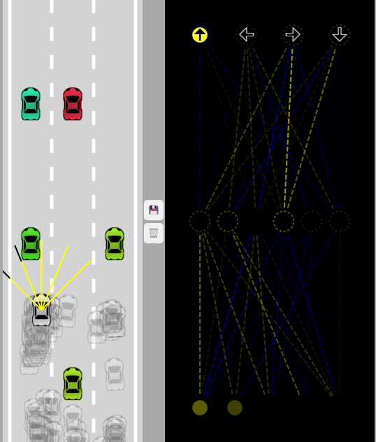

# Self-Driving Car with JavaScript (No Libraries)

This course uses JavaScript and the 2D canvas to create a self driving car simulation using: 

* **Sensors** for collision detection, implemented using simple segment intersection formulas
* A **neural network** for the car to learn how to drive without crashing, accompanied by a **visualization** of the network on real time

The end result looks something like this:

## Neural Network Visualization

The bottom level has a neuron for each ray sensor on the car. The closer the object, the more intensely the neuron will fire up. 

The top level indicates which decision is the car taking based on the input from the sensors

Both weights and biases are values between -1 and 1. This is represented like this:
* Weights are represented as connections between the neurons.
* Biases are represented as a countour arround the outputs.
* Yellow lines represent values closer to 1.
* Blue lines represent values closer to -1.
* The closer a weight or bias is to 0, the more transparent it becomes.

The objective is to find the best neural network, and for that we start by testing many random AIs. On each step, we keep the neural network that got the furthest and use it as a base for the next generation.

By using **mutations**, we slightly change the previously best neural network to try to find improvements.